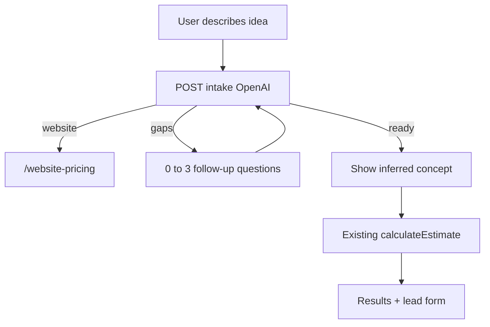

#  Streamline custom pricing with OpenAI intake

## What stays, what changes

Custom pricing lives at `[/custom-software-estimator](app/custom-software-estimator/page.tsx)` (Project Blueprint), not on `[/website-pricing](app/website-pricing/page.tsx)`. Website packages and the contact-form quote path stay as they are.

Today the estimator is an 8-screen adaptive questionnaire (`[components/project-blueprint/app.tsx](components/project-blueprint/app.tsx)`: `hero → mode → describe → journey → review → results`). “Describe my idea” already exists (`[describe-mode.tsx](components/project-blueprint/describe-mode.tsx)`) but only runs a **client-side keyword** classifier, then dumps the user into the same long journey. OpenAI is already wired in `[lib/project-blueprint/classifier/ai.ts](lib/project-blueprint/classifier/ai.ts)` and `[POST /api/project-blueprint/classify](app/api/project-blueprint/classify/route.ts)`, but it only emits taxonomy chips and **never prices**.

The estimate itself is a deterministic PERT engine (`[calculateEstimate](lib/project-blueprint/engine/calculate.ts)` + `[POST /api/project-blueprint/calculate](app/api/project-blueprint/calculate/route.ts)`). Same answers + same pricing config always produce the same ZAR range. **Keep that.** OpenAI must not invent hours, rates, or money.

## New public journey

Replace phases with: **hero → describe → (optional clarifications) → concept preview → results**.

1. **Hero** — Keep brand and “planning estimate, not a quote” disclaimer. Copy shifts from “answer a few practical questions” to “describe what you want to build.” One CTA into the textarea.
2. **Describe** — One large textarea (reuse the existing copy/placeholder in `[describe-mode.tsx](components/project-blueprint/describe-mode.tsx)`). Submit calls a new intake API. No mode picker, no guided journey, no chip-confirm-then-wizard.
3. **Clarifications (only if needed)** — At most **3 questions**, at most **2 rounds**. Questions come from a **whitelist** of high-impact catalogue items, not free-form chat. After that, remaining gaps are marked `not_sure` so the engine widens bands instead of inventing precision.
4. **Concept preview** — Short “here is what we understood” (headline, who it is for, surfaces, capabilities, assumptions, open questions). User can edit the original text and resubmit, or proceed.
5. **Results** — Existing `[results-view.tsx](components/project-blueprint/results-view.tsx)` + `[lead-form.tsx](components/project-blueprint/lead-form.tsx)`. Enrich with the AI concept brief; still call existing calculate + leads APIs.

If intake classifies `route.website`, redirect to `/website-pricing` the same way the old route screen did.

## OpenAI’s job: intake, not pricing

Add `POST /api/project-blueprint/intake` (server-only). Reuse the existing `fetch` + JSON pattern in `[classifier/ai.ts](lib/project-blueprint/classifier/ai.ts)`; do not send rates or the pricing config to the model.

**Request**

- `ideaText` (required)
- `clarifications` (optional answers from the previous round)
- session token if already created

**Response (Zod-validated)**

- `status`: `needs_clarification` | `ready` | `website_handoff`
- `concept`: headline, summary, who it is for, core capabilities in plain language, assumptions
- `answers`: a `ProjectBlueprintAnswers` patch using **only** existing catalogue IDs (`route.`*, `surface.*`, `cap.*`, etc.)
- `clarifyingQuestions`: 0–3 items, each pointing at a whitelist question id with constrained options
- `unknowns`: fields left as `not_sure` / `need_advice`

**Prompt constraints**

- System prompt includes the taxonomy ID lists from `[catalogue.ts](lib/project-blueprint/questions/catalogue.ts)` (or a compact derived list) so the model cannot invent IDs.
- Explicit: never return prices, hours, rates, timelines as numbers, or ZAR amounts.
- Prefer fewer, high-confidence capabilities over stuffing the bag.
- Unknowns are allowed and expected.

**Server sanitisation**

- Drop any ID not in the catalogue.
- Cap capabilities/integrations/surfaces to sane lengths.
- Strip pricing language from concept text (same idea as the existing note filter in `classifier/ai.ts`).
- `normalizeAnswers()` then `calculateEstimate()` only after `status === "ready"`.

**Clarification whitelist (high-impact only)**

Only ask when not inferable from the paragraph:

- Product shape / surfaces (web vs portal vs native mobile vs admin)
- Starting point (new vs existing vs legacy replacement)
- Payments in-product?
- External systems to connect / data migration
- Who uses it and rough scale / multi-tenant
- Sensitive or regulated data
- Timing (optional)

Everything else (role counts, MFA, CI/CD, etc.) is inferred or marked unknown so uncertainty bands widen.

## UI / code changes

**Replace the public shell** in `[components/project-blueprint/app.tsx](components/project-blueprint/app.tsx)`:

- Remove `mode` and `journey` phases from the public flow.
- Collapse describe + clarifications + preview into the main path (evolve `[describe-mode.tsx](components/project-blueprint/describe-mode.tsx)` rather than adding a chat UI).
- Keep `[review-screen.tsx](components/project-blueprint/review-screen.tsx)` behaviour as the concept preview (plain-language summary, not the 8-section editor).
- Keep calculate, results, lead capture, autosave-to-session if a session exists.

**Keep, do not delete:** question catalogue, branching, `ProjectBlueprintAnswers`, engine, admin quotes/calibration. The AI writes into that schema; the engine still reads it.

**Leave unused for now (or hide):** `[step-screen.tsx](components/project-blueprint/step-screen.tsx)` and the mode picker. Do not rip out the catalogue or engine tests.

**Copy:** hero, page metadata in `[app/custom-software-estimator/page.tsx](app/custom-software-estimator/page.tsx)`, and the website-pricing CTA in `[components/website-pricing.tsx](components/website-pricing.tsx)` so they describe “tell us the idea” instead of “start the questionnaire.”

## Env, reliability, and ops

- `OPENAI_API_KEY` becomes required for a high-quality intake. Keep `PROJECT_BLUEPRINT_AI_CLASSIFIER_MODEL` (default `gpt-4o-mini`; allow override).
- Treat intake as enabled when the key is present (or reuse `PROJECT_BLUEPRINT_AI_CLASSIFIER_ENABLED`).
- **Fallback if OpenAI is down:** keyword classifier in `[classifier/keyword.ts](lib/project-blueprint/classifier/keyword.ts)` + extra unknowns + discovery-recommended result, plus a message to add more detail or contact the team. Never fail closed with no estimate if we can still run the engine.
- Rate-limit the intake route (IP + session); cap `ideaText` at ~4000 chars (already the classify limit).
- Update `[docs/project-blueprint/specification.md](docs/project-blueprint/specification.md)` journey and `[operations.md](docs/project-blueprint/operations.md)` env notes so they match intake-not-pricing.

## Tests

- Unit: intake schema, illegal ID stripping, max 3 questions, website handoff, pricing-language rejection.
- Unit: keyword fallback still produces a valid `ProjectBlueprintAnswers` that `calculateEstimate` accepts.
- Existing engine tests stay; they prove inferred answers still price deterministically.
- Update `[e2e/project-blueprint.spec.ts](e2e/project-blueprint.spec.ts)`: start → textarea → submit (mock intake if needed) instead of Guided questions.

## Verification

Walk `/custom-software-estimator` in the browser: rich description with no follow-ups; sparse description that triggers 1–3 questions; website-shaped description that hands off to `/website-pricing`; then results + lead form. Confirm `/website-pricing` packages are unchanged.