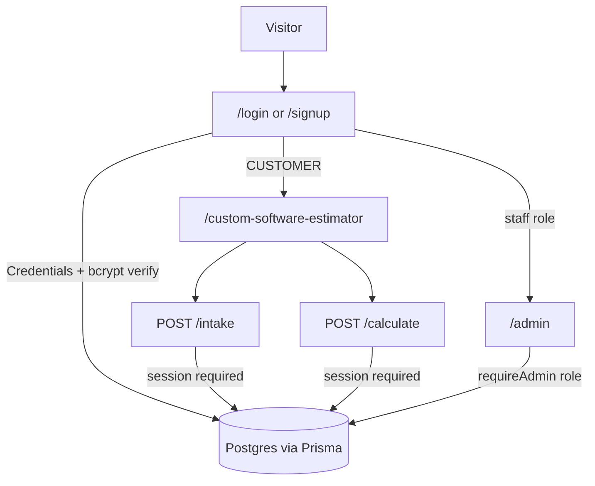

# Sign-up gate, NextAuth, and Prisma/Postgres

## Recommendation (read this first)

- **Use Auth.js v5** (`next-auth@5`), not NextAuth v4. This app is Next 16 App Router; v5 is the supported App Router API (`auth.ts` + `app/api/auth/[...nextauth]/route.ts`). Same product you asked for (“NextAuth”).
- **Use Prisma + PostgreSQL.** An ORM is worth it here: typed models, migrations that travel with Docker, and one place for users *and* estimates. Raw SQL would duplicate what the old Supabase migration already describes.
- **Hash passwords with bcrypt (cost 12+)** via `bcryptjs` (pure JS). Argon2id is slightly stronger but native bindings are painful on `node:22-alpine`. Store only `passwordHash`. Never send the hash to the client. Compare only in `authorize()`.
- **JWT sessions** (Auth.js default for Credentials): no extra session table required; `AUTH_SECRET` signs the cookie. Revoke by rotating the secret or adding a `User.passwordChangedAt` check later if needed.
- **Do not finish anonymous `gc_pb_session` resume.** Login *is* identity. Save drafts as `Estimate.userId`. Drop the “Progress could not be saved” guest path.
- **Gate APIs, not only the page.** `/custom-software-estimator` plus `POST /api/project-blueprint/intake` and `calculate` (and related customer APIs). A hidden fetch must not skip signup.
- **Signup always creates `CUSTOMER`.** Staff roles (`REVIEWER` / `ADMIN` / `APPROVER`) only via seed or an existing admin. Public signup must never self-promote.
- **Phased delivery.** Auth + estimator gate + user-owned drafts first. Then port admin inbox/quotes/calibration off Supabase. Removing `@supabase/*` last. Doing “everything” in one change is how this stalls.

Docker does not store users. Add a **`db` service** in [docker-compose.yml](docker-compose.yml); the `web` image stays stateless.

## Current state (what we are replacing)

- Estimator page [app/custom-software-estimator/page.tsx](app/custom-software-estimator/page.tsx) is public.
- [proxy.ts](proxy.ts) only protects `/admin` with **Supabase** cookies; demo mode allows admin with no auth when env is unset.
- Staff check: [lib/project-blueprint/auth/admin.ts](lib/project-blueprint/auth/admin.ts) + `admin_profiles` in Supabase.
- Customer APIs (`intake`, `calculate`, `leads`, …) are anonymous.
- Guest save in [components/project-blueprint/app.tsx](components/project-blueprint/app.tsx) POSTs `/session/save` **without** `sessionId` (the warning you saw).
- Schema source to port: [supabase/migrations/20260721000000_project_blueprint.sql](supabase/migrations/20260721000000_project_blueprint.sql).

## Phase 1 — Auth foundation

**Packages:** `next-auth@5`, `@auth/prisma-adapter` (optional; not required for Credentials+JWT), `prisma`, `@prisma/client`, `bcryptjs`, `@types/bcryptjs`, `pg`.

**Env:** `DATABASE_URL`, `AUTH_SECRET` (32+ random bytes), `AUTH_URL` / `NEXT_PUBLIC_SITE_URL`. Seed: `BOOTSTRAP_ADMIN_EMAIL` + `BOOTSTRAP_ADMIN_PASSWORD` (used only by `prisma/seed.ts`, never committed).

**Prisma models (minimum):**

- `User`: `id`, `email` (unique, lowercased), `name`, `passwordHash`, `role` (`CUSTOMER` | `REVIEWER` | `ADMIN` | `APPROVER`), `isActive`, timestamps.
- Later phases add `Estimate`, `Lead`, quotes, etc. (mirror the SQL migration, with `userId` instead of `auth.users` / token_hash).

**Auth.js Credentials provider** in a server-only `auth.ts`:

- `authorize`: lookup by email, skip if `!isActive`, `bcrypt.compare`, return `{ id, email, name, role }` (never `passwordHash`).
- JWT + session callbacks copy `role` onto the session.
- Cookies: `httpOnly`, `sameSite: lax`, `secure` in production.

**Routes / UI** (match existing BrandButton / site chrome):

- `/signup` — email, name, password (min 12), confirm; create `CUSTOMER`; then sign in and send to estimator (or `callbackUrl`).
- `/login` — unified login; `callbackUrl` for estimator vs admin.
- `/admin/login` — redirect to `/login?next=/admin/project-blueprint`.
- Sign out: Auth.js `signOut`. Navbar: Sign in / Account when on public pages.

**Rate limit** signup + login (reuse the intake limiter pattern in [lib/project-blueprint/intake/rate-limit.ts](lib/project-blueprint/intake/rate-limit.ts)).

**Bootstrap:** `npx prisma db seed` creates the first `ADMIN` if none exists.

## Phase 2 — Gate the estimator (the product rule)

**[proxy.ts](proxy.ts)** (keep Next 16 `proxy`, do not add a second `middleware.ts`):

- `/signup`, `/login`, `/api/auth/*` public.
- `/custom-software-estimator` → unauthenticated redirect to `/login?next=/custom-software-estimator`.
- `/admin` (except we fold login) → must be staff role, else 403 or home.
- Do **not** leave the old “Supabase unset = open admin” hole in production. Local seed admin instead.

**Server `auth()` in APIs:** helper `requireUser()` / rewrite `requireAdmin()` to read Auth.js session + `User.role` from Prisma (delete Supabase `getUser` / `admin_profiles`).

Protect at least:

- `POST /api/project-blueprint/intake`
- `POST /api/project-blueprint/calculate`
- `POST /api/project-blueprint/classify`
- `POST /api/project-blueprint/leads`
- `POST /api/project-blueprint/session*` (replace or remove)
- `GET /api/project-blueprint/document/[estimateId]` (owner or staff)

**UI:** [components/project-blueprint/hero.tsx](components/project-blueprint/hero.tsx) copy: estimate is for signed-in users. Start CTA can stay; the page/proxy enforces login.

**Do not** call OpenAI until `requireUser()` succeeds.

## Phase 3 — User-owned estimates (replace guest session)

Replace anonymous token session with:

- `Estimate`: `userId`, `status`, `answers` JSON, `concept` JSON, `lastScreen`, `publicResult` JSON, `privateTrace` JSON (never return trace to the client), timestamps.
- Optional `AnswerRevision` append-only.

Wire [components/project-blueprint/app.tsx](components/project-blueprint/app.tsx):

- On ready / debounce: `PUT` authenticated estimate (no guest `sessionId`).
- On calculate: persist public result + private trace server-side; return public only (same as today).
- Remove the broken save banner (or show it only on real DB errors).
- Delete unused `/session/resume` client call or implement as “load my latest draft” via Auth.js user id.

Leads: `Lead.userId` + `estimateId`; consent still required.

## Phase 4 — Port admin data off Supabase

Map existing tables to Prisma (names can stay close to SQL): `PricingVersion`, `PricingDraft`, `EstimateResult` (or fold into `Estimate`), `ReviewedQuotation`, `QuoteVersion`, `QuoteLineItem`, `QuoteMilestone`, `QuoteApproval`, `UploadedBrief`, `AnalyticsEvent`, `CalibrationRecord`, `AuditEvent`.

Rewrite these to Prisma (same JSON responses so UI can stay):

- [app/api/admin/project-blueprint/estimates/route.ts](app/api/admin/project-blueprint/estimates/route.ts) and `[id]`
- quotes, calibration
- analytics insert in [lib/project-blueprint/analytics/events.ts](lib/project-blueprint/analytics/events.ts)
- uploads sign/scan if you keep uploads

Demo inbox ([lib/project-blueprint/admin/demo-data.ts](lib/project-blueprint/admin/demo-data.ts)) only when `DATABASE_URL` is missing in local UI — not as an auth bypass.

Then remove `@supabase/ssr` / `@supabase/supabase-js` from estimator/admin paths.

## Docker and ops

Extend [docker-compose.yml](docker-compose.yml):

- `db`: `postgres:16`, volume, healthcheck, `POSTGRES_USER/PASSWORD/DB`.
- `web`: `depends_on: db` (healthy), `DATABASE_URL=postgresql://...@db:5432/...`, `AUTH_SECRET`.
- Builder: `npx prisma generate`; deploy: `npx prisma migrate deploy` before `node server.js` (entrypoint script).

Document in [docs/project-blueprint/operations.md](docs/project-blueprint/operations.md). Add a real `.env.example` (no secrets): `DATABASE_URL`, `AUTH_SECRET`, `OPENAI_API_KEY`, etc.

## Tests (keep small and meaningful)

- Unit: hash on create, `authorize` rejects bad password / inactive user; signup cannot set `ADMIN`.
- API: unauthenticated `POST /intake` → 401; authenticated → existing intake behaviour.
- E2E: login redirect on estimator; after login, describe flow still runs (can mock intake as today).

## Security checklist

- Password hash only at rest; unique email; min length 12.
- `AUTH_SECRET` required in production (fail start if missing).
- Staff routes check **role**, not merely “logged in”.
- Estimate document/PDF only for owner or staff.
- Rate-limit auth endpoints; keep intake IP limit as a second layer.
- No passwords in logs, analytics, or Prisma logging.

## Out of scope (unless you ask)

- OAuth/Google/magic-link (can add later; Credentials is enough for hashed passwords).
- Email verification / reset-password (add Resend templates in a follow-up).
- Guest-then-claim-draft.
- Changing the PERT pricing engine or OpenAI intake prompts.
