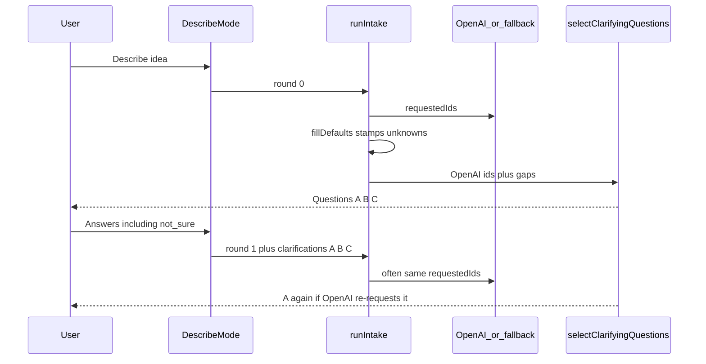

# Fix duplicate intake follow-up questions

This change is only about the **extra questions** after the idea textarea on Project Blueprint. Prices still come from the existing PERT engine. OpenAI still must not invent money.

## How it works today (junior walkthrough)

Imagine a receptionist with a **fixed menu of 8 questions** (surfaces, starting point, payments, and so on). They may show at most **3 per round**, and at most **2 rounds**.

Every submit goes through [`lib/project-blueprint/intake/run.ts`](lib/project-blueprint/intake/run.ts):

1. Start from `previousAnswers` (empty on the first submit).
2. If the user just clicked options, **apply** those clicks ([`applyClarifications`](lib/project-blueprint/intake/whitelist.ts)).
3. Ask OpenAI (or keyword fallback) which question IDs to show.
4. **`sanitiseAnswers` / `fillDefaultsAndUnknowns`** fills any empty fields with guesses (e.g. `start.new_idea`, public web) **and** stamps `unknowns[questionId] = "not_sure"`.
5. **`selectClarifyingQuestions`** takes OpenAI’s IDs first, then gap-fills. It only de-dupes **inside this one response**. It does **not** skip IDs the user already answered.

That is why duplicates happen **across rounds**, not twice on the same screen.

**“I’m not sure yet” is a real click.** `apply` strips `not_sure`. If nothing else is selected, it only calls `markUnknown` (sets `unknowns[id] = "not_sure"`). It does **not** mean “never ask this again.” Only payments is treated as settled in `inferGapQuestionIds`. OpenAI’s `requestedIds` are still accepted blindly.

**Trap:** you cannot “skip every ID in `unknowns`” while fill-defaults still runs **before** picking questions. On round 0, defaults already mark surfaces, starting point, users, timing, and more as `not_sure`. Skipping all of those would hide the first round of questions entirely.

## The rule we want

A whitelist question is **settled** (do not show it again) if any of these is true:

- The user already submitted it this session (clicked a real option **or** “I’m not sure yet”).
- `answers.unknowns[id]` is set **because the user said not sure**, not only because defaults guessed.
- The matching answer field is already filled from OpenAI/fallback **before** defaults (the idea already answered it).

Defaults for pricing should run **after** we know whether we still need to ask, so guesses do not look like “already answered.”

## Implementation

### 1. Skip settled IDs when picking questions

In [`lib/project-blueprint/intake/whitelist.ts`](lib/project-blueprint/intake/whitelist.ts):

- Add `excludeIds?: string[]` to `selectClarifyingQuestions`.
- Skip an ID if it is in `excludeIds`, or `answers.unknowns[id]` is set, or a small helper says the mapped field is already filled (surfaces length, `startingPoint`, payment caps / `pay.none`, integrations, `userGroups`, and so on).
- Teach **`inferGapQuestionIds`** the same skip for **every** whitelist ID, not only payments. “Not sure” is a finished answer for this short intake.

Keep the existing caps: max 3, nothing on `round >= 2`.

### 2. Fill defaults only when we are done asking

Split catalogue cleanup from guessing in [`lib/project-blueprint/intake/sanitise.ts`](lib/project-blueprint/intake/sanitise.ts):

- Keep dropping illegal IDs / merging the AI patch (needed every time).
- Call `fillDefaultsAndUnknowns` in `runIntake` **only** when the result is `ready`, `website_handoff`, or `forceReady` (round 2).

On `needs_clarification`, return the **sparse** bag (user clicks + AI IDs, no invented public-web / new-idea). The client already stores `data.answers` as `previousAnswers`, so round 1 will not think those fields were already decided.

Update [`hasCriticalScope`](lib/project-blueprint/intake/run.ts) behaviour as a consequence: empty surfaces after round 0 is a reason to keep asking, which is what we want.

### 3. Remember what was already asked (belt and braces)

Round 1 already sends the round-0 clicks as `clarifications`, so the server can exclude those IDs. Round 2 is forced ready today, but do not rely on memory of a single request.

- Extend [`lib/project-blueprint/intake/request.ts`](lib/project-blueprint/intake/request.ts) with optional `askedQuestionIds` (whitelist IDs, small max).
- In [`components/project-blueprint/describe-mode.tsx`](components/project-blueprint/describe-mode.tsx), accumulate IDs whenever questions are shown, and send that list on later submits.
- `runIntake` builds `excludeIds` = `askedQuestionIds` ∪ this request’s `clarifications[].questionId`.

### 4. Make “apply” consistent

In [`whitelist.ts`](lib/project-blueprint/intake/whitelist.ts), every `apply` that stores a **real** option should **clear** that question’s unknown flag (today only surfaces does). Use `clearUnknownMarker` from [`lib/project-blueprint/answer-path.ts`](lib/project-blueprint/answer-path.ts). `markUnknown` can stay as-is: keep any earlier guess for later pricing, but the question is settled via `unknowns`.

Optional small UI fix in `toggleValue`: if the user picks “I’m not sure yet” on a multi-select, clear other chips (and the reverse). Stops “Public website” + “I’m not sure yet” on the same question. Not required to stop duplicates.

### 5. Tell OpenAI the same rule

In `buildIntakeSystemPrompt` / `buildIntakeUserPrompt` ([`run.ts`](lib/project-blueprint/intake/run.ts)): do not put an ID in `clarifyingQuestionIds` if it is in `userClarifications` or already in `answers.unknowns`. The server skip is the real guard; the prompt just reduces wasted IDs.

## Tests (this is how we know it is fixed)

Add cases in [`tests/project-blueprint/intake.test.ts`](tests/project-blueprint/intake.test.ts):

- **Duplicate after not sure:** round 0 returns `q.surfaces.channels`; user sends `not_sure`; round 1 OpenAI requests the same ID → that ID is **absent**.
- **Duplicate after a real click:** same as above with `surface.public_web` → do not ask surfaces again; other unsettled IDs may still appear.
- **Gaps respect unknowns:** `inferGapQuestionIds` does not add `q.surfaces.channels` when `unknowns["q.surfaces.channels"]` is set, even if `surfaces` is empty.
- **Round 0 still asks:** empty bag, no defaults yet → surfaces / starting point can still appear (proves we did not skip-all-unknowns too early).
- Existing tests keep working: max 3, round 2 empty, website handoff, messy JSON coerce, `usedFallback: false`.

No browser flow is required for this logic; the bug is server-side selection. After implementation, a quick manual pass on `/custom-software-estimator` (answer “I’m not sure yet” on round 1, confirm round 2 is different or skipped) is enough.

## Out of scope

- Changing the 8-question menu, max 3, or max 2 rounds.
- Letting OpenAI invent prices.
- Guided catalogue journey (already removed from the public describe flow).
