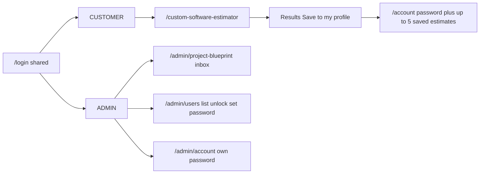
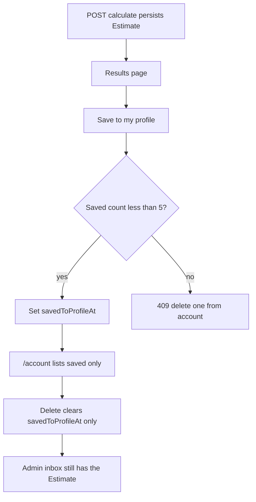

# Simplify auth, admin users, and estimator leftovers

## What is overcomplicated today

Roles are already only `CUSTOMER` | `ADMIN` ([prisma/schema.prisma](prisma/schema.prisma)), but the product still mixes them:

- One shared [`/account`](app/account/page.tsx) password screen for both roles.
- Admin chrome is estimate-ops only ([Inbox / Pricing / Calibration](components/project-blueprint/admin-shell.tsx)) with **no user list**, no admin password reset, and **no persisted lockout** (only an in-memory 10 hits / 15 min rate limit in [lib/auth/rate-limit.ts](lib/auth/rate-limit.ts)).
- Unfinished estimator ops still shipped: read-only [pricing page](app/admin/project-blueprint/pricing/page.tsx), [calibration UI/API](app/admin/project-blueprint/calibration/page.tsx), standalone [HTML document route](app/api/project-blueprint/document/[estimateId]/route.ts), unused DocRaptor adapter, stub uploads, unused `PricingDraft` / `QuoteApproval` / `CalibrationRecord` tables.

Login stays **shared** (`/login`). Only account/password screens split. There is no customer “forgot password” email flow; admins reset passwords from the admin panel.

## 1. Persisted lockout (timed + admin unlock)

Add on `User`:

- `failedLoginCount Int @default(0)`
- `lockedUntil DateTime?`

Constants in [lib/auth/constants.ts](lib/auth/constants.ts): **5** failed attempts, **15 minute** cooldown (aligned with the existing rate-limit window). Keep the IP+email in-memory rate limit as a second layer.

Update [lib/auth/verify-credentials.ts](lib/auth/verify-credentials.ts):

- If `lockedUntil > now`, reject as locked (do not increment further).
- If the lock has expired, treat as unlocked and continue the attempt (reset count to 0 lazily).
- Wrong password: increment `failedLoginCount`; at the threshold set `lockedUntil = now + 15m`.
- Correct password: reset `failedLoginCount` and `lockedUntil`.
- Inactive users (`isActive`) still fail as today.

Surface a distinct login error (“This account is temporarily locked. Try again in a few minutes.”) via Auth.js `CredentialsSignin` in [auth.ts](auth.ts) and [components/auth/login-form.tsx](components/auth/login-form.tsx). Invalid credentials stay generic.

Admin **Unlock** sets `failedLoginCount = 0` and `lockedUntil = null` immediately.

## 2. Admin panel: users, unlock, set password (not the customer account page)

Keep the existing admin shell and inbox/quote builder. Replace Pricing/Calibration nav with:

- **Users** → `/admin/users`
- **Account** → `/admin/account` (admin’s own password, current password required)
- **Inbox** stays `/admin/project-blueprint`

**Users page** ([app/admin/users/page.tsx](app/admin/users/page.tsx)): table of all users (email, name, role, created, failed attempts, locked until / locked badge). Actions: **Set password** (new + confirm, min 12 chars, no current password) and **Unlock** when locked. Never display hashes.

APIs (all `requireAdmin()`, Zod-validated UUIDs/passwords, Prisma `where`/`data` only):

- `GET /api/admin/users`
- `POST /api/admin/users/[id]/password`
- `POST /api/admin/users/[id]/unlock`

Reuse [lib/auth/password.ts](lib/auth/password.ts) `hashPassword`. Write `AuditEvent` rows for set-password and unlock.

Gate the **customer** change-password API so admins cannot use it as their reset UI: [app/api/auth/change-password/route.ts](app/api/auth/change-password/route.ts) returns 403 for `ADMIN`. Admin self-change uses `POST /api/admin/account/password` (same `changePassword()` helper, current password required).

**Route split** in [proxy.ts](proxy.ts):

- `/account` requires a session; if `ADMIN`, redirect to `/admin/account`.
- `/admin/*` unchanged (staff only).
- Public `SessionNav` can keep linking to `/account`; the proxy redirect is the split.

## 3. Customer profile: opt-in save, max 5, delete

Calculating an estimate already writes an `Estimate` + `EstimateResult` (for the session and the admin inbox). That does **not** put it on the customer profile.

Add `savedToProfileAt DateTime?` on `Estimate` (null = not on the profile). Constant `PROFILE_ESTIMATE_LIMIT = 5` in [lib/auth/constants.ts](lib/auth/constants.ts) (or a small `lib/account/estimates.ts` helper).

### Results page — Save to my profile

On the final results UI ([components/project-blueprint/results-view.tsx](components/project-blueprint/results-view.tsx)), next to “Email me this estimate”, add **Save to my profile**.

Pass the **Estimate.id** from [app/api/project-blueprint/calculate/route.ts](app/api/project-blueprint/calculate/route.ts) (`estimateId` in the JSON, not `result.estimateId`, which is the result-row id). [components/project-blueprint/app.tsx](components/project-blueprint/app.tsx) already keeps that id.

- Not saved: enabled button → `POST /api/account/estimates` with `{ estimateId }`.
- Already saved: disabled “Saved to your profile” (or a link to `/account`).
- At cap: clicking returns an error and a link to `/account` to delete one.

### Account page

Widen [app/account/page.tsx](app/account/page.tsx). Keep `ChangePasswordForm`. List **only** estimates where `userId = session.user.id` **and** `savedToProfileAt` is set (newest first), max 5:

- Date, status, concept/product summary, recommended ZAR range when a result exists.
- **Delete** on each row (confirm in the UI first). This only removes it from their profile list; the admin inbox still has it.
- Empty state + link to `/custom-software-estimator`.
- No issued-quote records.

The list needs a small client island so delete can refresh without a full design rewrite.

### APIs

- `POST /api/account/estimates` — save to profile
- `DELETE /api/account/estimates/[id]` — remove from profile only (unsave)

`requireUser()`, **CUSTOMER only** (admins use the inbox, not these slots). Zod UUID. Prisma `where: { id, userId: session.user.id }` on every read/write.

**Save** (transaction):

1. Load the estimate by id **and** `userId`. 404 if missing (do not leak other users’ ids).
2. Require a calculated result.
3. If already saved, return ok (idempotent).
4. Count this user’s rows with `savedToProfileAt != null`. If `>= 5`, **409** — do not save.
5. Set `savedToProfileAt = now()`.

**Delete** (remove from profile only — admin inbox always keeps it):

- Load the estimate by id **and** `userId`, and require `savedToProfileAt` to be set. 404 otherwise (do not leak other users’ ids).
- Set `savedToProfileAt = null`. Do **not** `prisma.estimate.delete`. Results, leads, and any `ReviewedQuotation` stay in the database.
- That frees one of the 5 profile slots. The customer can save a different estimate (or save this one again later from results if they still have the id).

Admin inbox lists estimates regardless of `savedToProfileAt`, so unsaved and un-saved-from-profile calculations remain visible to staff.

## 4. Remove unfinished pricing config and HTML rendering

**Delete UI/API (keep the working estimator engine and admin inbox/quote builder):**

- [app/admin/project-blueprint/pricing/page.tsx](app/admin/project-blueprint/pricing/page.tsx)
- [app/admin/project-blueprint/calibration/page.tsx](app/admin/project-blueprint/calibration/page.tsx) and [app/api/admin/project-blueprint/calibration/route.ts](app/api/admin/project-blueprint/calibration/route.ts)
- [app/api/project-blueprint/document/[estimateId]/route.ts](app/api/project-blueprint/document/[estimateId]/route.ts)
- [lib/project-blueprint/pdf/docraptor.ts](lib/project-blueprint/pdf/docraptor.ts)
- Stub uploads: [app/api/project-blueprint/uploads/](app/api/project-blueprint/uploads/) and the scan-callback auth exemption in [proxy.ts](proxy.ts)
- Unused [app/api/project-blueprint/classify/route.ts](app/api/project-blueprint/classify/route.ts) (keep keyword classifier used by intake)

**Call-site fixes:**

- Remove “Open client HTML document” from [app/admin/project-blueprint/[id]/page.tsx](app/admin/project-blueprint/[id]/page.tsx).
- Lead email in [app/api/project-blueprint/leads/route.ts](app/api/project-blueprint/leads/route.ts) / [lib/project-blueprint/email/resend.ts](lib/project-blueprint/email/resend.ts): drop the document URL; point people to sign in at `/account` instead.

**Keep:** `PLACEHOLDER_PRICING_CONFIG` in the calculate engine, question catalogue, intake, results React UI, estimate persistence, admin inbox + quote POST.

**Schema cleanup migration** (unused tables that exist only as scaffolding): drop `PricingDraft`, `QuoteApproval`, `CalibrationRecord`, `UploadedBrief`; drop `EstimateResult.pricingVersionId` / `PricingVersion` (admin estimate APIs already fall back to `publicResult.pricingVersion`). Strip matching `User` relations. Do **not** drop `Estimate` / `EstimateResult` / quote models. Add `savedToProfileAt` in the same migration family as lockout fields.

## 5. Security measures

**Authentication and cookies** (already in [auth.config.ts](auth.config.ts)): JWT session, `httpOnly`, `sameSite: "lax"`, `secure` in production. Mutations rely on that cookie, not a user id from the body. Keep open-redirect protection in [lib/auth/callback-url.ts](lib/auth/callback-url.ts).

**Authorization / IDOR:**

- Customer save/delete/list: `requireUser()` + role `CUSTOMER` + `userId` in every Prisma `where`.
- Admin user APIs: `requireAdmin()`; never take the target user from email string concatenation.
- Do not trust `estimateId` from the client without the ownership check.
- Enforce the **5-cap on the server** inside a transaction (UI is not enough).

**Input and SQL injection:**

- Runtime is already Prisma-only (no `$queryRaw` / `*Unsafe`). Do not add raw SQL.
- Zod-validate UUIDs, emails, passwords (min 12) on every new endpoint.
- Bind filters as Prisma objects only.

**Abuse controls:**

- Keep login/signup/change-password rate limits; add the same helper on save/delete (and admin set-password/unlock).
- Generic errors for other people’s ids (404).
- Confirm before remove-from-profile in the UI.
- Never return password hashes or `calculationTrace` on account list APIs (public result fields only).

**Lockout** (section 1) is part of this: brute-force resistance plus admin unlock.

## 6. Tests and verification

- Unit: lockout increment / lock / expiry / success reset / admin unlock; save succeeds under 5, 409 at 5, idempotent re-save; delete unsaves (row still exists); IDOR (wrong user id) 404.
- Update [tests/auth/verify-credentials.test.ts](tests/auth/verify-credentials.test.ts) mocks to include `update`.
- E2E: results page shows Save; `/account` empty then one saved item with Delete; admin hitting `/account` lands on `/admin/account`; `/admin/users` forbidden to customers.
- Browser-check: save at cap, delete to free a slot, password change, admin users (list, set password, lock then unlock), estimator still calculates, pricing/calibration/HTML routes 404.

Do not commit unless asked.
